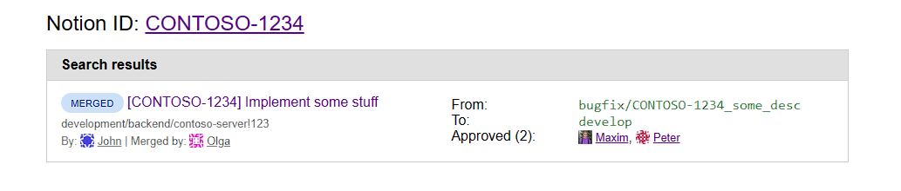

# GitLab MR Searcher

1. Deploy to Cloudflare Workers
2. Set environment:
```
wrangler secret put GITLAB_BASE_URL # example value: https://gitlab.acme.corp
wrangler secret put GITLAB_TOKEN # example value: glpat-XXXXXXXXXX
```
3. Open `<your-worker-domain>/mr?search=PREFIX1-1111&search=PREFIX2-1111&notionId=PREFIX3-3333` to search GitLab MRs.

You can provide as many `search` arguments as you want (but at least one), and optionally provide `notionId` parameter to put `https://notion.so/<notionId>` link at the top and include this ID to search list.


### Demo

After deployment, open page with URL like this:
```
https://your-worker-name.contoso.workers.dev/mr?search=CONTOSO-1234&search=OTHERID-2345&notionId=CONTOSO-1234
```

And you will see search results:


You can add the following arguments to the query string:
* `search` [required] - Search string that will be searched on GitLab. You can provide multiple search arguments to use several IDs to search GitLab MR.
* `notionId` [optional] - If provided, direct URL to Notion will appear on the top of page directing to `https://notion.so/<id>`. Notion ID will be also added to search queries automatically.